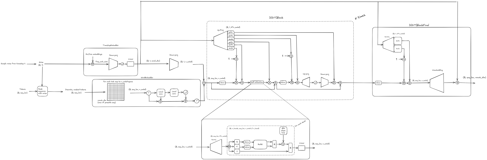
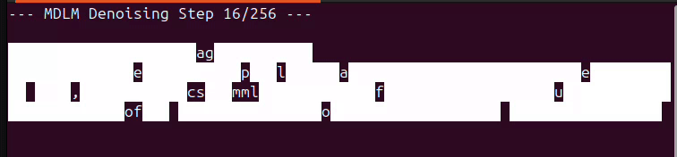
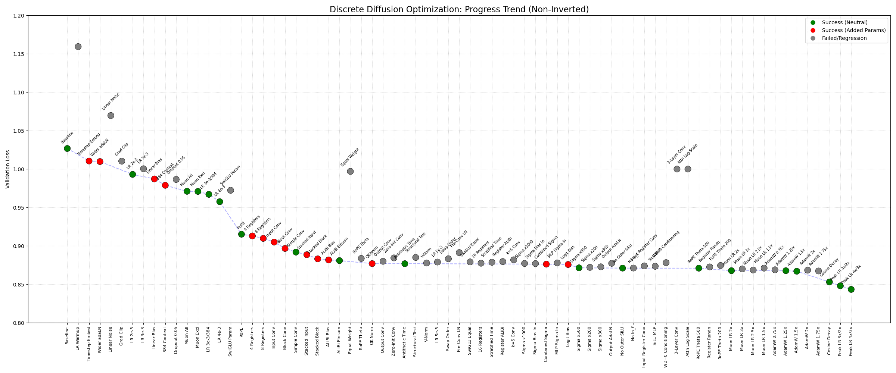
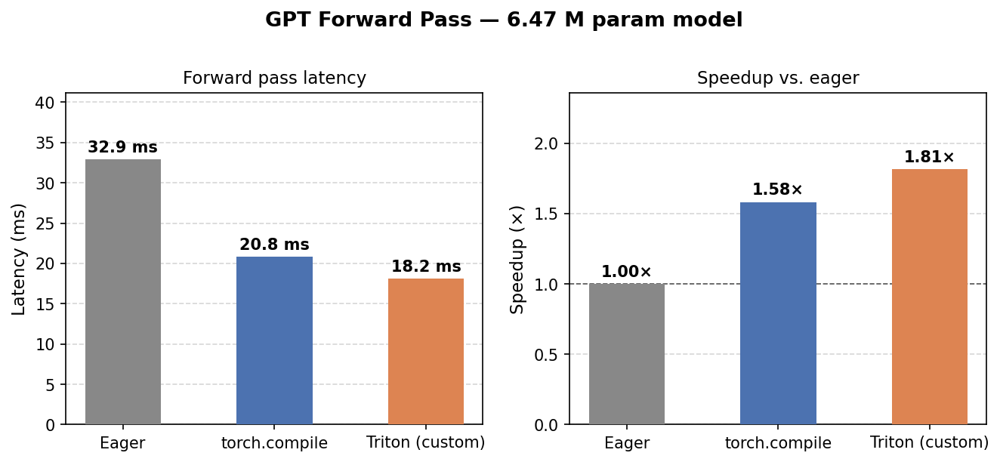

# Discrete Diffusion for Character-Level Text Generation

A discrete diffusion language model trained on Tiny Shakespeare at the character level. The model uses a DiT-style transformer backbone with adaptive layer normalization (adaLN) conditioned on a noise-level embedding, trained under a masking noise process similar to BERT, but with a diffusion-based conditioning variable t.

---

## Architecture



The model is a GPT-style transformer augmented with diffusion-specific components as well as some architectural improvements found during ablation testing:

- **DiT conditioning** — adaLN per block modulates residual branches with shift/scale/gate scalars derived from the noise level `σ`.
- **DynTanh normalization** — replaces LayerNorm with `γ · tanh(α · x) + β`; ~18 % training speedup with comparable loss.
- **RoPE + ALiBi** — rotary positional embeddings on Q/K, with learnable per-head distance penalties that encourage local attention.
- **Depthwise convolutions** — stacked k=3 depthwise convs at the input and after each transformer block capture short-range character-level features (receptive field = 5).
- **Dual sigma bypass** — zero-initialized `sigma_in` and `sigma_out` projections add direct noise-level signals at the embedding and logit levels, complementing adaLN.

Total parameters: **< 6.5 M** on 3080Ti.

---

## Demo

The video below shows iterative confidence-based unmasking during inference (MaskGIT-style): the model starts from a fully masked sequence and progressively reveals the most confident tokens.

The demo is run on the 3-layer model that is trained for 6 minutes on the 3080Ti, so the text itself is not very coherent.



---

## Quick Start

### Environment

The project uses [pixi](https://prefix.dev/docs/pixi/overview) for dependency management:

```bash
pixi install
pixi shell
```

### Prepare data

```bash
python shakespeare_char/prepare.py
```

This downloads Tiny Shakespeare, tokenizes it at the character level (65 tokens + `[MASK]`), and writes `train.bin` / `val.bin` / `meta.pkl`.

---

## Training & Evaluation

### Single run

```bash
python train.py
```

Configuration is managed by [Hydra](https://hydra.cc/). Override any key from `conf/base_config.yaml`:

```bash
python train.py model.n_embd=256 trainer.lr=2e-3
```

### Standardized 2-epoch benchmark

```bash
python run_eval.py
```

Trains for 2 epochs, parses the latest Hydra output directory, prints the final validation loss from `val_loss_log.csv`, and shows the generated sample from `summary.txt`.

### Hyperparameter sweep (Hydra multirun)

```bash
python train.py --multirun model.timestep_embedding=true,false
python train.py -m --config-name sweep_muon_masking
```

---

## Ablation Results

As a part of the Claude Code evaluation at my department, I decided to let the agents run in an ablation loop, doing something similar to Autoresearch by Andrei Karpathy.

The table below traces the ablation journey from the initial baseline to the final best configuration. See [autoresearch/worklog.md](autoresearch/worklog.md) for the full experiment log (~105 experiments).

Note that the ablation results were done with a more naive BERT-based CE-loss that did not consider the dependency between diffused tokens. This leads to "better" looking output, but is inherently independent

| Milestone | Val Loss | Key change |
|---|---|---|
| Baseline | 1.0268 | Default config |
| + timestep embedding | 1.0105 | Sinusoidal σ features |
| + RoPE | 0.9152 | Replaces learned positional embeddings |
| + depthwise convolutions | 0.8832 | Stacked k=3 input + per-block convs of embeddings |
| + ALiBi + QK-Norm | 0.8770 | Locality bias + attention stabilization |
| + cosine LR with warm restarts | 0.8531 | Per-epoch LR cycling |
| + EMA (decay=0.998) | 0.8203 | Exponential model averaging for eval |
| + batch size tuning (96) | 0.7960 | Small batches -> more gradient steps but slower runtime |
| **Final (Exp 104)** | **0.7920** | CosineAnnealingWarmRestarts |

**Final generated sample (EMA model, 256 inference steps):**
```
 to take your honour to you, my lord.

MENENIUS:
I will not come to have them, for you have you need,
To give me with your honour to your consent,
And you are your honour and your mother,
Your honour save you yet thae more,
You have done to the matters of the cause;
But the time shall be crook'd upon my gage,
And make my hearted  the house of the nose,
That he is no more that mame
```

Runtime on a single RTX 5080 Ti: **~5 minutes** for 2 epochs.



---

## Key Files

| File | Role |
|---|---|
| `model.py` | GPT, DDiTBlock, SelfAttention, DynTanh, noise schedules |
| `train.py` | Training loop, Muon + AdamW, EMA, validation |
| `losses.py` | Score-entropy and masking loss dispatch |
| `dataset.py` | ShakespeareDataset, StringHandler, perturbation functions |
| `inference_helpers.py` | Masking, substitution |
| `run_eval.py` | Qualitative benchmark |
| `conf/base_config.yaml` | Hydra configuration |
| `autoresearch/worklog.md` | Full autoresearch ablation experiment log |

---

## Performance Tuning

Beyond architecture search, the model's forward pass was optimized at the kernel level using `torch.compile` and custom [Triton](https://triton-lang.org/) kernels (see `triton/`). Benchmarked on the 6.47 M parameter model on the 3080Ti:

| Backend | Latency | Speedup |
|---|---|---|
| Eager (PyTorch) | 32.9 ms | 1.00× |
| `torch.compile` | 20.8 ms | 1.58× |
| Triton (custom kernels) | 18.2 ms | 1.81× |



---

## Statement of Feedback

This project was submitted for feedback and evaluated using large language models for suggestions and code quality assessment.

---

## Statement of AI Use

AI assistance (Claude) was used in the following capacities:

- **Bug fixing** — diagnosing and correcting training instabilities, dtype mismatches, and memory issues.
- **Plot code generation** — producing visualization scripts for loss curves, profiling outputs, and experiment comparisons.
- **Autoresearch ablation** — running the autonomous research loop (`CLAUDE.md` protocol) to systematically explore hyperparameter and architecture changes, logging results in `autoresearch/worklog.md`.

All suggested model design decisions, experiment hypotheses, and final configuration choices were verified by the author.
